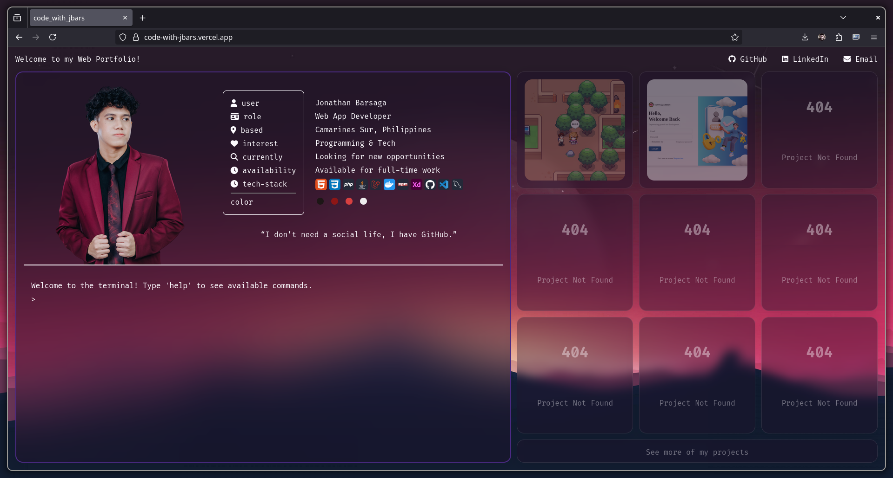

# 🌐 Personal Web Portfolio

This is my personal web portfolio — a place where I showcase who I am, what I do, and what I’ve built.

🔗 **Live Site:** [code-with-jbars.vercel.app](https://code-with-jbars.vercel.app)

---

## 📸 Screenshot

---

## 🎯 Inspiration

This portfolio is **heavily inspired by the [Hyprland](https://github.com/hyprwm/Hyprland) [ML4W](https://github.com/mylinuxforwork/dotfiles) dynamic tiling window manager**.

I recently discovered Hyprland and immediately loved its minimal yet powerful tiling layout. Using it daily has significantly boosted my productivity — so I decided to bring that same clean and organized feel to my web portfolio.

---

## 🛠️ Features To Be Added

- [ ] Fix the top header bar / "waybar"-style nav
- [ ] Responsive grid layout for small devices
- [ ] Wallpaper auto-switcher
- [ ] Dynamic theme color based on current wallpaper

---

## 📦 Tech Stack

  

---

## 📄 License

This project is open source and available under the [MIT License](LICENSE).
